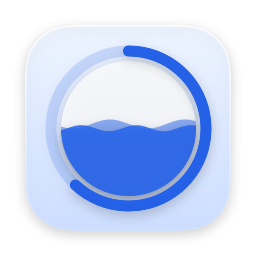

<p align="center">
  
</p>

<h1 align="center">Pour</h1>

<p align="center">Pour 25 minutes into your work.</p>

A free macOS menu bar Pomodoro for Todoist. Start a session and a small always-on-top glass card shows the round you are in, the countdown, and water rising as the time goes by. The session is the unit, not the task: finish something with time left on the clock and point it at the next thing without restarting anything.

## Features

- Menu bar app, no Dock icon. Search and filter your Todoist tasks (Upcoming, Today, Overdue, 7 days), with a count on each.
- **The session outlives the task.** Complete a task, swap to another, or run with none attached — the clock never restarts. "Work on this" in the menu bar points the running session at whatever you pick.
- Rounds and long breaks. Four focus rounds then a longer one, with both lengths and the count in Settings. Which break you get is read back from the log, so nothing can drift.
- Every session recorded, focus and breaks alike, with the minutes each task got. The Today view reads it back, and `🍅 14 min focus` is posted once per task the round touched.
- Floating card over every app and Space. Blue water fills while you focus, green drains during the break. Liquid Glass on macOS 26, translucent material before that. Wide or compact.
- Pause, +5 min, Complete task, Skip the break, Stop — on the card, in the menu bar, or from the right-click menu. Sessions survive quitting the app. Menu bar glyph fills with progress; a cup replaces it during breaks.

## Install

### Homebrew

```sh
brew tap iammayron/tap
brew trust iammayron/tap   # Homebrew 6 requires trusting third-party taps once
brew install --cask pour
```

Pour is not signed with an Apple Developer ID yet. The cask removes the Gatekeeper quarantine flag on install, so it opens directly.

### Manual

1. Download `Pour.app` from [Releases](https://github.com/iammayron/pour/releases) and move it to `/Applications`.
2. Remove the quarantine flag:

   ```sh
   xattr -dr com.apple.quarantine /Applications/Pour.app
   ```

   Or right-click `Pour.app` → Open, then confirm in System Settings → Privacy & Security → Open Anyway.
3. Open Pour. Click the timer icon in the menu bar → cog → **Connect Todoist**, and approve the request in the window that opens.

Sign-in uses OAuth with PKCE and no client secret, so nothing has to be pasted anywhere. Prefer a personal token? Open "Use an API token instead" in Settings and paste one from Todoist → Settings → Integrations → Developer.

Either way the credentials live in `~/Library/Application Support/Pour/todoist-token`, readable only by your user, and never leave your Mac except to talk to Todoist.

Sessions are recorded next to them in `sessions.json` — plain JSON, yours to read or delete.

## Build from source

Requires Xcode 26 and [XcodeGen](https://github.com/yonaskolb/XcodeGen).

```sh
brew install xcodegen
./scripts/dev-cert.sh      # once, optional: stable local signing identity instead of ad-hoc
xcodegen generate
xcodebuild -scheme Pour -configuration Debug -derivedDataPath build build
open build/Build/Products/Debug/Pour.app
```

Shared logic lives in `Packages/TodoistCore` (Todoist API client, token store, Pomodoro state machine, session log). Run its tests with `cd Packages/TodoistCore && swift test`.

Design source is in `design/` (Claude Design artboards).

## Roadmap

- Signed and notarized builds
- Auto-start the next round when a break ends
- iOS app on the same core, with a Live Activity countdown
- Android
